**SmartMedicine-智能医疗App**
=============================

# 项目介绍

#### 智能医疗App:

##### 项目功能

文章推荐, 医疗社区, 动态发布, 在线问诊, AI问答, 疾病预测, 便捷搜索等功能


启动页面


登录页


注册页


首页推荐
* 推荐算法采用MF矩阵分解, FM隐因子, NCF神经网络
* 矩阵分解采用SVD、ALS
* 用户, 帖子 特征基于Neo4j知识图谱的实体关系集合
* Android端在[点赞, 收藏, 评论, 搜索, 浏览]都进行了埋点时间, 根据规则集对该用户在该实体的感兴趣程度做埋点
* 埋点数据通过Kafka(隐性评分)和Http请求(显性评分)交给feature-service并做计算
* 推荐层采用Lambda架构, 分为[在线层, 近线层, 离线层]: 
  * 在线层: 使用实时数据, 保证实时响应
  * 近线层: 使用实时数据 + 离线计算数据, 尽量实时响应
  * 离线层: 定时任务, 不使用实时数据, 离线计算历史数据, 保证精确性.


AI问诊 (v2.0版本由Bert升级为Spring AI 调用DeepSeek)
* Spring AI 进行AI应用层开发具有更好的意图识别和实体命名识别
* RAG增强索引
  * 用户结构化数据问题的模糊实体通过Milvus向量索引匹配精确实体, 交给Neo4j和ElasticSearch进行知识抽取
  * 用户非结构化数据的问题直接使用Milvus向量索引相关文档交给DeepSeek进行AIGC
* MCP 协议
  * 集成了MCP Service和Client, ChatModel集成MCP之后调用@ToolService能为用户提供App内快捷的操作, 如:
    * AI快捷搜索查询
    * AI快捷挂号
    * AI快捷充值


文章搜索
* 文章搜索采用Mysql的Like匹配 + ElasticSearch分层搜索策略
* 策略图如下
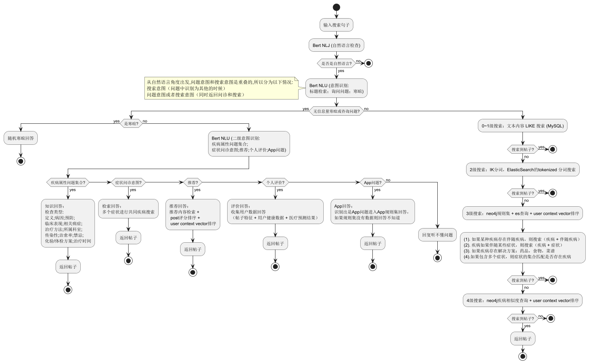


搜索 \ 添加好友
* 系统采用Netty进行长连接, 不使用WebSocket. 相比Websocket, Netty的长连接更加轻便.
* Json序列化需要Java进行反射, 耗时较长. 项目采用Protobuf传输数据, 减少数据在网络应用层转化耗时


好友 \ 预览


消息界面


聊天
* 聊天后端使用Netty和RabbitMq进行消息传递.
* 前端使用EventBus进行异步消息传递, 避免的Activity销毁而导致数据丢失
* 前端使用了MMKV进行缓存数据, 并使用Room(SQLite)对消息进行本地持久化


挂号预约
* 挂号预约采用Redisson的原子令牌进行获取商品锁和归还商品锁, 避免了超预约问题.
* 订单支付队列采用RabbitMq的正常队列 + 死信队列组成 消息延迟支付功能
* 超时未支付则执行取消事务: 订单取消并回滚商品
* 关于在支付过程中出现订单超时问题. 在支付过程中如果出现了订单超时并且回滚则用乐观锁验证最终一致性. 如果最终不一致则事务回滚

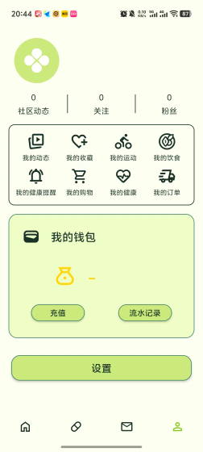

我的页面


# ** 注意上述, 以上为2025年9月升级最新版本, 而下面的内容为2024年本人毕业设计内容(未升级的系统) **


##### 环境配置

[项目环境配置介绍](环境配置.md)

##### 模块及其技术栈

* 推荐算法：协同过滤，基于内容，神经网络
* 搜索引擎：ElasticSearch、word2vec/IK分词搜索、知识图谱
* IM系统：SpringCloud系列，Netty
* 网关：spring-cloud-gateway + Nginx
* 终端：Android、JNI/NDK
* 大数据：Hadoop、Spark、Flink、Hive、HBase
* 爬虫：selenium、lxml
* 后台：JS，Vue，ElementUI

[Spring项目](spring-server/README.md)
[Android项目](android-frontend/README.md)

## 设计思路

(下面内容包含UML图,要查看UML需要下载IDEA的插件:PlantUML):[PlantUML插件](https://plugins.jetbrains.com/plugin/7017-plantuml-integration)

[项目设计思路](项目设计思路.md)

### 项目基本功能
* 推荐系统
  * 用户特征提取：
    * 最近浏览记录
    * 搜索记录
    * 聊天记录分词
  * 搜索推荐
    * Bert意图分类 + 知识图谱获取获取实体
  * 文章推荐
    * 召回
    * 粗排精排、重排、曝光去重
    * 数据分析：Flink、Hive、Spark，Hadoop
* 医疗社区
    * 发布帖子 [发布帖子UML时序图](spring-server/business/post-service/docs/发布帖子.puml)
* AI问诊
* 搜索
  * 搜索用户
    * 模糊匹配用户Account(MySQL的like)
    * 模糊分词匹配用户的Name(ElasticSearch的IK分词搜索)
  * 搜索帖子
      * 分词搜索帖子（ElasticSearch的IK分词搜索）
      * 相关性关键词/帖子推荐（推荐系统(搜索模块)：知识图谱 + NLP）
* 个人
  * 疾病预测（多层感知机 + 全连接层）
  * 用药提醒（Netty实现IM）
  * 好友聊天（Netty实现IM）
  * 点赞收藏记录

## ⚠注意

此项目为个人2024年天津科技大学本科毕业设计论文，仅供开源学习参考。禁止用于其他用途。/

[项目论文-本人本科毕业设计论文](20201220-陈治宇-基于机器学习的智能医疗对话APP的设计.pdf)

## 内容介绍

##### 文章推荐

基于nlp的内容推荐(Bert模型推荐分类 + 知识图谱) + 基于协同过滤\矩阵推荐(User CF,Item CF,MF,ALS,SVD) + 神经网络推荐(NCF)


推荐系统结果

根据用户行为，搜索内容，留存时间等进行推荐


推荐模块文章

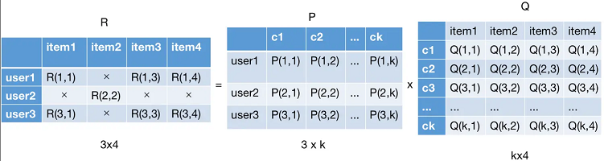

矩阵分解

矩阵分解是为了从用户-item 矩阵中提取潜在因素，以便更好地预测用户对未见过物品的偏好，解决系数矩阵问题

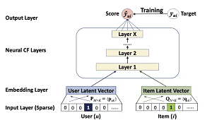

NCF算法框架

传统的矩阵分解方法（如 SVD）通常假设用户和物品之间的关系是线性的，而 NCF 通过使用深度学习模型，可以捕捉到更复杂的非线性关系，从而提高推荐的准确性。

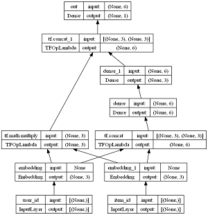

NeuMF张量图

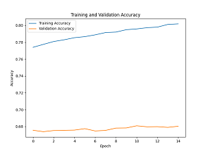

NeuMF_acc

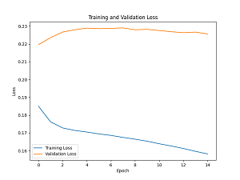

NeuMF_loss

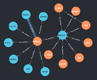

知识图谱

推荐系统中：知识图谱通过结构化的形式组织了大量的实体及其之间的关系，使推荐系统能够更好地理解用户的兴趣和偏好。

自然语言理解中：用于自然语言理解之后生成cql语句查询数据然后槽填充回答问题。

关系查询

```sql
SELECT r.relationship, e2.name
FROM entities AS e1
JOIN relationships AS r ON e1.id = r.entity1_id
JOIN entities AS e2 ON r.entity2_id = e2.id
WHERE e1.name = 'Entity A';
```

Mysql关系查询

```sql
MATCH (e:Entity {name: 'Entity A'})-[r]->(related)
RETURN r, related;
```

知识图谱查询关系

##### 搜索引擎

搜索引擎采用：ElasticSearch + word2vec/IK分词搜索 + 知识图谱

###### 词语相似关系模糊搜索

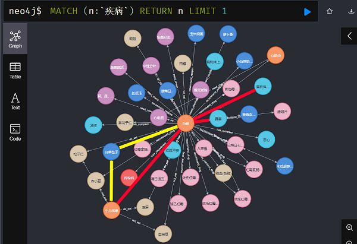
知识图谱-图路径
用于实体相似度功能,实现搜索引擎中的模糊搜索。
例如:搜索`"感冒"`会推荐`"鼻塞"`；其本质就是推荐。

###### 词语分词模糊搜索

ElasticSearch:倒排索引,用IK活着word2vec分词，实现搜索引擎中的分词模糊搜索。
例如搜索`"感冒症状"`若无,则会分词为`"感冒"` + "症状"搜索,如果存在`"感冒发烧的症状"`类似`"感冒" + "*" + "症状"`则会返回

##### AI问诊

基于nlp的自然语言理解(Bert意图分类) + 基于知识图谱的问答(知识图谱实体索引 + 槽填充)

查询意图分为:


对话_病因


对话_问诊


对话_治疗

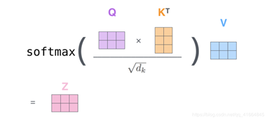

Attention注意力机制

**Attention机制**是一种模仿人类注意力的机制，用于在处理信息时选择性地聚焦于特定部分。其主要思想是：在输入序列中，不同的词对输出的影响是不同的。Attention 机制通过计算输入序列中每个词的权重，决定哪些词在生成输出时更重要。

Bert是基于Transformer的，Transformer又是基于Attention机制的。

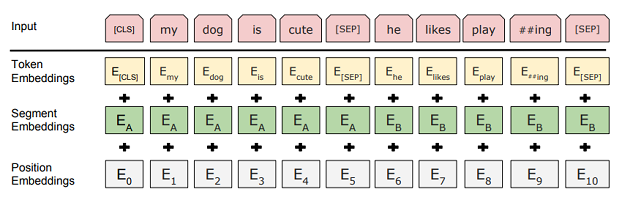

Bert词嵌入

BERT 接受输入时，会将每个词转换为向量，并加入位置编码和分段编码，以保留词序信息和句子信息。

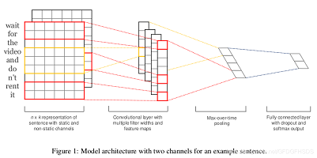

Text-CNN

Text-CNN通过卷积层捕捉短语和词组的局部特征，能够有效识别文本中的重要模式和结构，相比于传统的 RNN 或 LSTM，CNN 在处理长文本时具有更高的计算效率。

Text-CNN 在自然语言分类中的作用：特征提取，提高分类性能。

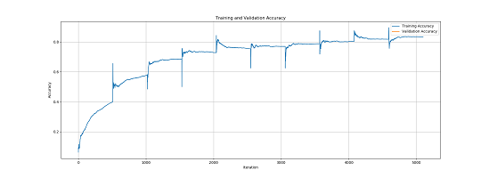

Bert模型意图分类准确度acc

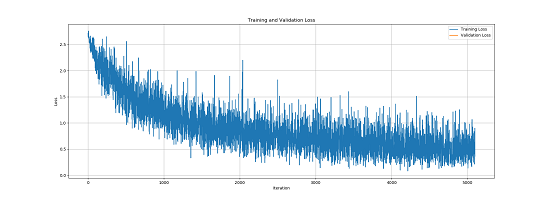

Bert loss函数损失值梯度下降

##### 医疗预测

数据源：Kaggle开源数据平台:[心脏病预测 --- Heart Disease Predictions](https://www.kaggle.com/code/desalegngeb/heart-disease-predictions)

使用多层感知机 + 全连接层实现预测：

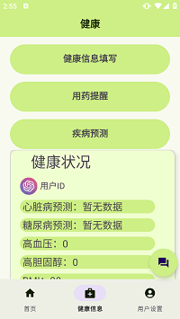

用户健康信息查看


健康预测

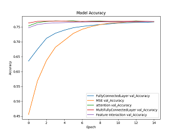

各种方法进行对比的acc准确度与训练轮次的关系

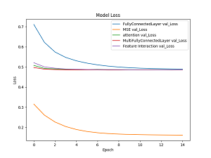

各种方法的loss与训练轮次的对比（其中MSE是均方误差，由于计算公式的原因，其loss远低于其他函数，但是并不代表其模型效果最好）

## 项目环境

### Spring Cloud 微服务架构
* JDK 11
* Spring Boot：2.3.12.RELEASE
* Spring Cloud：Hoxton.SR1
* Spring Alibab：2.2.0.RELEASE
* Nacos
* Nginx
* ElasticSearch 7.6.2
* MongoDB
* MySQL
* Redis
* RabbitMq

### ElasticSearch
* ElasticSearch 7.6.2
* 分词器：IK分词器
* 词典：配置在：\config\analysis-ik 路径下，将需要的配置写在.dic文件中，然后保存在IKAnalyzer.cfg.xml；例如：
```xml
<?xml version="1.0" encoding="UTF-8"?>
<!DOCTYPE properties SYSTEM "http://java.sun.com/dtd/properties.dtd">
<properties>
	<comment>IK Analyzer 扩展配置</comment>
	<!--用户可以在这里配置自己的扩展字典 -->
	<entry key="ext_dict">
		search_test.dic
	</entry>
	 <!--用户可以在这里配置自己的扩展停止词字典-->
	<entry key="ext_stopwords"></entry>
	<!--用户可以在这里配置远程扩展字典 -->
	<!-- <entry key="remote_ext_dict">words_location</entry> -->
	<!--用户可以在这里配置远程扩展停止词字典-->
	<!-- <entry key="remote_ext_stopwords">words_location</entry> -->
</properties>
```
  在添加扩展词典之后需要从新启动ElasticSearch服务器，否则不会生效。
* 

### Android
* JDK 17
* Kotlin：ktx:1.8.0
* C++ 11
* NDK：21.1.6352462

### 推荐算法
* Python 3.9
* Anaconda 
* Tensorflow 2
* CUDA;CUDNN
* Pytorch

## 开发工具

Spring后端：
* IntelliJ IDEA
* Navicat 16（MySQL）
* JMeter（压测）
* Kibana（可视化ElasticSearch）

终端Android：
* Android Studio

推荐算法
* Pycharm

## 资源相关

由于Bert模型过大没有放到项目中，可以去Hugging Face下载一个Bert中文模型
[Hugging Face模型网站](https://huggingface.co/models)
或者下载我的百度网盘链接：
[Bert模型百度网盘链接](https://pan.baidu.com/s/137UH7WW44cQysRUTwLLgiA?pwd=smme)
提取码: smme

下载成功之后将其添加到路径：[Bert路径](python_nlp/nlu/bert_intent_recognition/Bert) 下面